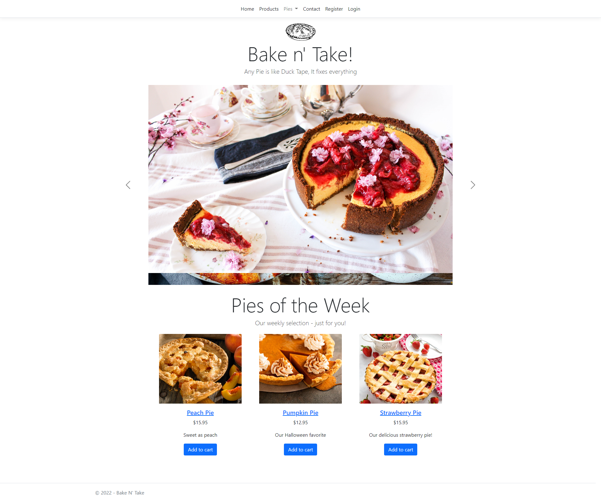
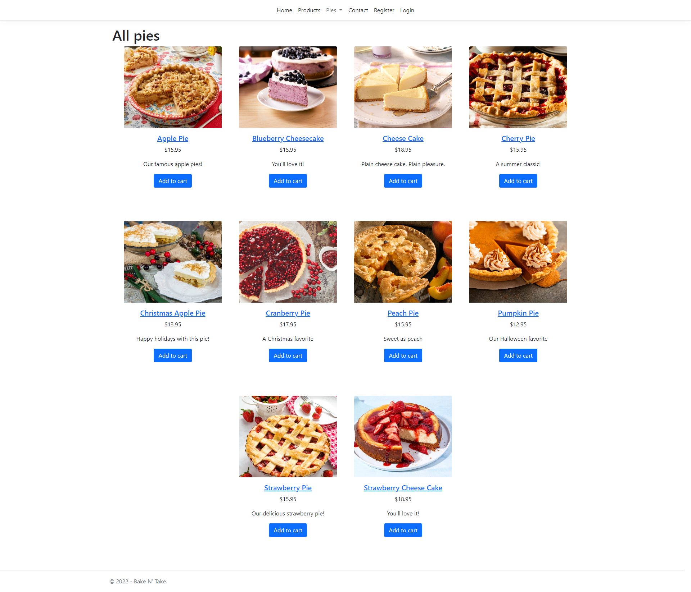
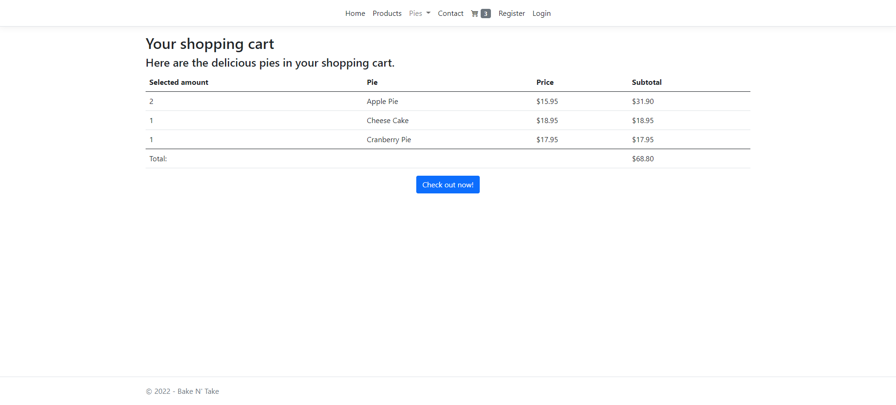
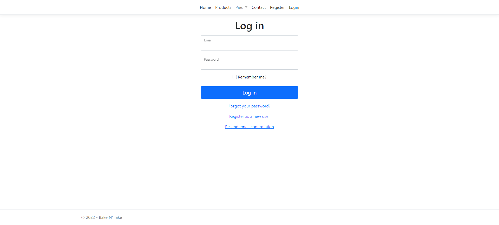
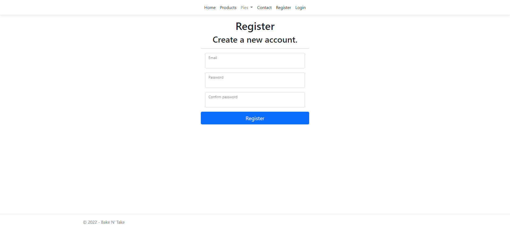
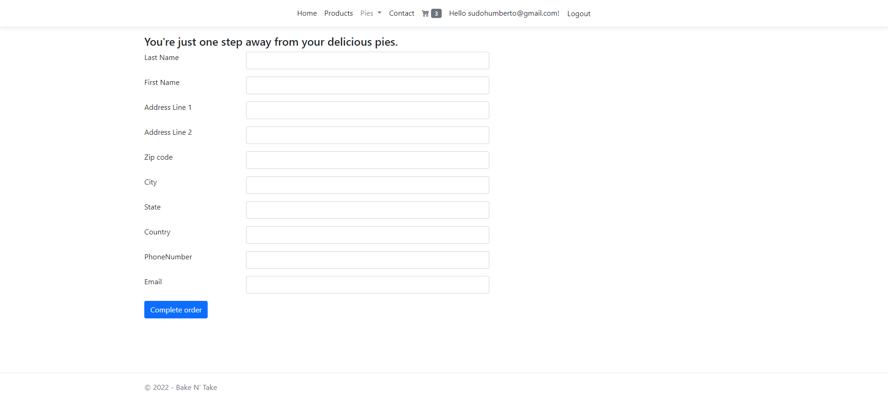

# Bake And Take

Bake And Take is the name of a fictional cakes shop web site. 

It is implemented with NET CORE 6 (LTS) and MVC in a single project.

The application is based in the examples of the courses: 
* ASP.NET Core 6 Fundamentals by Gill Cleeren.
* Building Web Applications with ASP.NET Core 3 and 5 MVC by Gill Cleeren.

## Requirements

1. Create or Update the database. 

Open `View`>`Other Windows`>`Package Manager Console` and run:

```
update-database
```

## How-to?

1. Add or Remove a Migration.

Update the model or attributes you need. Then, in the Package Manager Console run:

```
add-migration [MigrationName]
```

If something went wrong, you can always delete the last migration with. In the Package Manager Console run:

```
remove-migration
```

## Screenshots

### Home


### Products


### Shoppingcart


### Login


### Register


### Checkout
